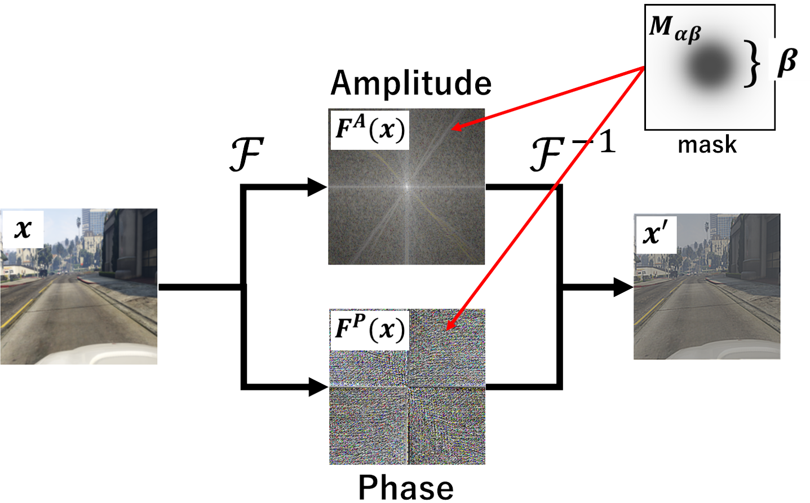

# [CVPR2025 Workshops] Domain Generalization through Attenuation of Domain-Specific Information

[reiji saito](https://zxwei.site), [kazuhiro hotta]()  
Meijo University (JAPAN)

 
Paper: https://openaccess.thecvf.com/content/CVPR2025W/DG-EBF/html/Saito_Domain_Generalization_through_Attenuation_of_Domain-Specific_Information_CVPRW_2025_paper.html

# ADSI when using DINOv2
|Setting |mIoU |Config|Log & Checkpoint|
|-|-|-|-|
|**GTAV $\rightarrow$ Cityscapes**|**67.75**|[config](https://github.com/ReijiSoftmaxSaito/ADSI/releases/download/v1.0/ADSI.py)|[log](https://github.com/ReijiSoftmaxSaito/ADSI/releases/download/v1.0/20250101_172427.log) & [checkpoint](https://github.com/ReijiSoftmaxSaito/ADSI/releases/download/v1.0/ADSI_gta2avg.pth)
|**GTAV $\rightarrow$ BDD100K**|**61.38**|[config](https://github.com/ReijiSoftmaxSaito/ADSI/releases/download/v1.0/ADSI.py)|[log](https://github.com/ReijiSoftmaxSaito/ADSI/releases/download/v1.0/20250101_172427.log) & [checkpoint](https://github.com/ReijiSoftmaxSaito/ADSI/releases/download/v1.0/ADSI_gta2avg.pth)
|**GTAV $\rightarrow$ Mapillary**|**67.59**|[config](https://github.com/ReijiSoftmaxSaito/ADSI/releases/download/v1.0/ADSI.py)|[log](https://github.com/ReijiSoftmaxSaito/ADSI/releases/download/v1.0/20250101_172427.log) & [checkpoint](https://github.com/ReijiSoftmaxSaito/ADSI/releases/download/v1.0/ADSI_gta2avg.pth)