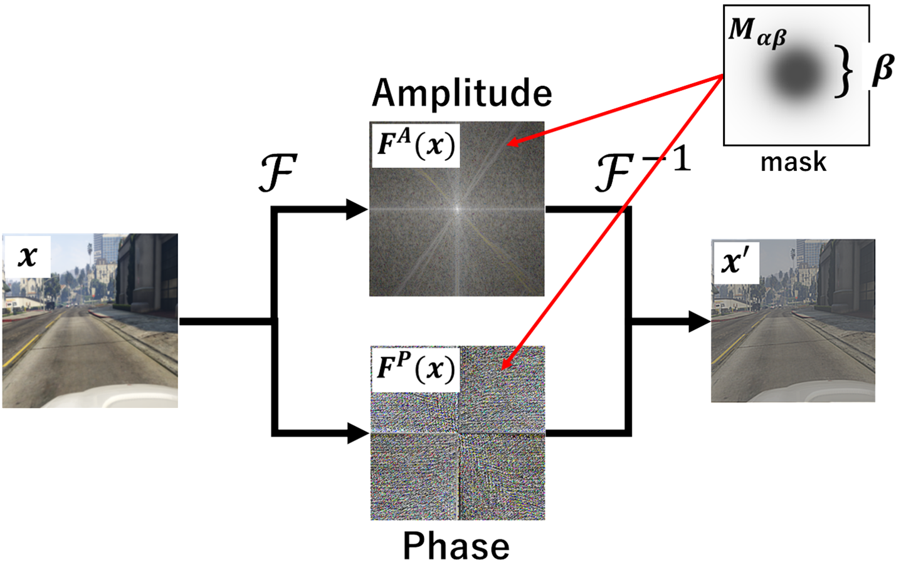

# [CVPR2025 Workshops] Domain Generalization through Attenuation of Domain-Specific Information

[Reiji Saito](https://www.researchgate.net/scientific-contributions/Reiji-Saito-2306878039), [Kazuhiro Hotta](https://wwwms.meijo-u.ac.jp/kazuhotta/) <br />
Meijo University, 🍣JAPAN🍜

[](https://paperswithcode.com/sota/domain-generalization-on-cityscapes-to-acdc?p=domain-generalization-through-attenuation-of)
[](https://paperswithcode.com/sota/domain-generalization-on-gta5-to-cityscapes?p=domain-generalization-through-attenuation-of)
[](https://paperswithcode.com/sota/domain-generalization-on-gta-to-avg?p=domain-generalization-through-attenuation-of)
<br />
Paper: https://openaccess.thecvf.com/content/CVPR2025W/DG-EBF/html/Saito_Domain_Generalization_through_Attenuation_of_Domain-Specific_Information_CVPRW_2025_paper.html



# ADSI when using DINOv2
|Setting |mIoU |Config|Log & Checkpoint|
|-|-|-|-|
|**GTAV $\rightarrow$ Cityscapes**|**67.75**|[config](https://github.com/ReijiSoftmaxSaito/ADSI/releases/download/v1.0/ADSI.py)|[log](https://github.com/ReijiSoftmaxSaito/ADSI/releases/download/v1.0/20250101_172427.log) & [checkpoint](https://github.com/ReijiSoftmaxSaito/ADSI/releases/download/v1.0/ADSI_gta2avg.pth)
|**GTAV $\rightarrow$ BDD100K**|**61.38**|[config](https://github.com/ReijiSoftmaxSaito/ADSI/releases/download/v1.0/ADSI.py)|[log](https://github.com/ReijiSoftmaxSaito/ADSI/releases/download/v1.0/20250101_172427.log) & [checkpoint](https://github.com/ReijiSoftmaxSaito/ADSI/releases/download/v1.0/ADSI_gta2avg.pth)
|**GTAV $\rightarrow$ Mapillary**|**67.59**|[config](https://github.com/ReijiSoftmaxSaito/ADSI/releases/download/v1.0/ADSI.py)|[log](https://github.com/ReijiSoftmaxSaito/ADSI/releases/download/v1.0/20250101_172427.log) & [checkpoint](https://github.com/ReijiSoftmaxSaito/ADSI/releases/download/v1.0/ADSI_gta2avg.pth)

## Citation
If you find our code or data helpful, please cite our paper:
```bibtex
@InProceedings{Saito_2025_CVPR,
    author    = {Saito, Reiji and Hotta, Kazuhiro},
    title     = {Domain Generalization through Attenuation of Domain-Specific Information},
    booktitle = {Proceedings of the Computer Vision and Pattern Recognition Conference (CVPR) Workshops},
    month     = {June},
    year      = {2025},
    pages     = {6459-6468}
}
```

## Environment Setup
To set up your environment, execute the following commands (※Please do not install mmsegmentation):
```bash
conda create -n ADSI -y
conda activate ADSI
conda install pytorch==2.0.1 torchvision==0.15.2 torchaudio==2.0.2 pytorch-cuda=11.7 -c pytorch -c nvidia -y
pip install -U openmim
mim install mmengine
mim install "mmcv>=2.0.0"
pip install "mmdet>=3.0.0"
pip install xformers=='0.0.20' # optional for DINOv2
pip install -r requirements.txt
pip install future tensorboard
```

## Dataset Preparation
The Preparation is similar as [DDB](https://github.com/xiaoachen98/DDB).

**Cityscapes:** Download `leftImg8bit_trainvaltest.zip` and `gt_trainvaltest.zip` from [Cityscapes Dataset](https://www.cityscapes-dataset.com/downloads/) and extract them to `data/cityscapes`.

**Mapillary:** Download MAPILLARY v1.2 from [Mapillary Research](https://research.mapillary.com/) and extract it to `data/mapillary`.

**GTA:** Download all image and label packages from [TU Darmstadt](https://download.visinf.tu-darmstadt.de/data/from_games/) and extract them to `data/gta`.

Prepare datasets with these commands:
```shell
cd ADSI
mkdir data
# Convert data for validation if preparing for the first time
python tools/convert_datasets/gta.py data/gta # Source domain
python tools/convert_datasets/cityscapes.py data/cityscapes
# Convert Mapillary to Cityscapes format and resize for validation
python tools/convert_datasets/mapillary2cityscape.py data/mapillary data/mapillary/cityscapes_trainIdLabel --train_id
python tools/convert_datasets/mapillary_resize.py data/mapillary/validation/images data/mapillary/cityscapes_trainIdLabel/val/label data/mapillary/half/val_img data/mapillary/half/val_label
```
(Optional) **ACDC**: Download all image and label packages from [ACDC](https://acdc.vision.ee.ethz.ch/) and extract them to `data/acdc`.

(Optional) **UrbanSyn**: Download all image and label packages from [UrbanSyn](http://www.urbansyn.org/#loaded) and extract them to `data/urbansyn`.

The final folder structure should look like this:

```
ADSI
├── ...
├── checkpoints
│   ├── dinov2_vitl14_pretrain.pth
│   ├── dinov2_rein_and_head.pth
├── data
│   ├── cityscapes
│   │   ├── leftImg8bit
│   │   │   ├── train
│   │   │   ├── val
│   │   ├── gtFine
│   │   │   ├── train
│   │   │   ├── val
│   ├── bdd100k
│   │   ├── images
│   │   |   ├── 10k
│   │   │   |    ├── train
│   │   │   |    ├── val
│   │   ├── labels
│   │   |   ├── sem_seg
│   │   |   |    ├── masks
│   │   │   |    |    ├── train
│   │   │   |    |    ├── val
│   ├── mapillary
│   │   ├── training
│   │   ├── cityscapes_trainIdLabel
│   │   ├── half
│   │   │   ├── val_img
│   │   │   ├── val_label
│   ├── gta
│   │   ├── images
│   │   ├── labels
├── ...
```
## Pretraining Weights
* **Download:** Download pre-trained weights from [facebookresearch](https://dl.fbaipublicfiles.com/dinov2/dinov2_vitl14/dinov2_vitl14_pretrain.pth) for testing. Place them in the project directory without changing the file name.
* **Convert:** Convert pre-trained weights for training or evaluation.
  ```bash
  python tools/convert_models/convert_dinov2.py checkpoints/dinov2_vitl14_pretrain.pth checkpoints/dinov2_converted.pth
  ```
  (optional for 1024x1024 resolution)
  ```bash
  python tools/convert_models/convert_dinov2.py checkpoints/dinov2_vitl14_pretrain.pth checkpoints/dinov2_converted_1024x1024.pth --height 1024 --width 1024
  ```
## Evaluation
  Run the evaluation:
  ```
  python tools/test.py configs/dinov2/rein_dinov2_mask2former_512x512_bs1x4_ADSI.py checkpoints/dinov2_rein_and_head.pth --backbone dinov2_converted.pth
  ```
  For most of provided release checkpoints, you can run this command to evluate
  ```
  python tools/test.py /path/to/cfg /path/to/checkpoint --backbone /path/to/dinov2_converted.pth #(or dinov2_converted_1024x1024.pth)
  ```

## Training
Start training in single GPU:
```
python tools/train.py configs/dinov2/rein_dinov2_mask2former_512x512_bs1x4_ADSI.py
```
Start training in multiple GPU:
```
PORT=12345 CUDA_VISIBLE_DEVICES=1,2,3,4 bash tools/dist_train.sh configs/dinov2/rein_dinov2_mask2former_512x512_bs1x4_ADSI.py NUM_GPUS
```

# Acknowledgements
We sincerely appreciate [Rein](https://github.com/w1oves/Rein), [mmsegmentation](https://github.com/open-mmlab/mmsegmentation), and [mmdetection](https://github.com/open-mmlab/mmdetection) for their wonderful implementations.